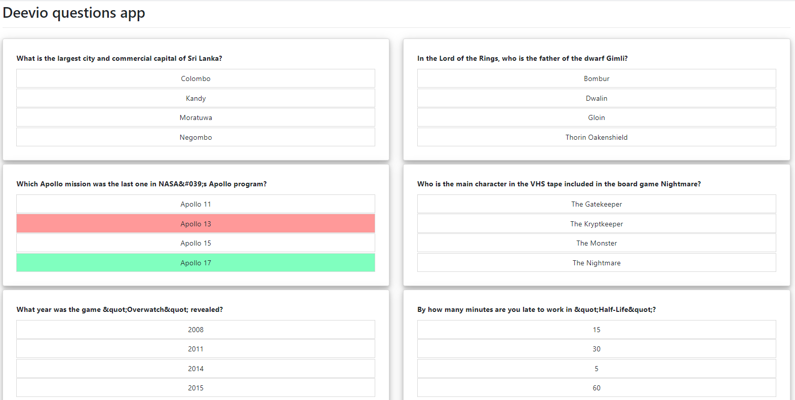
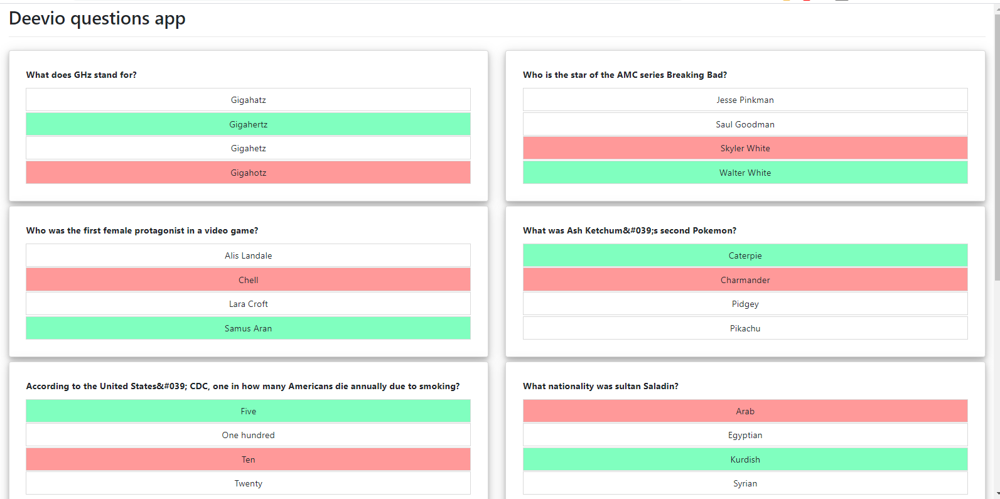
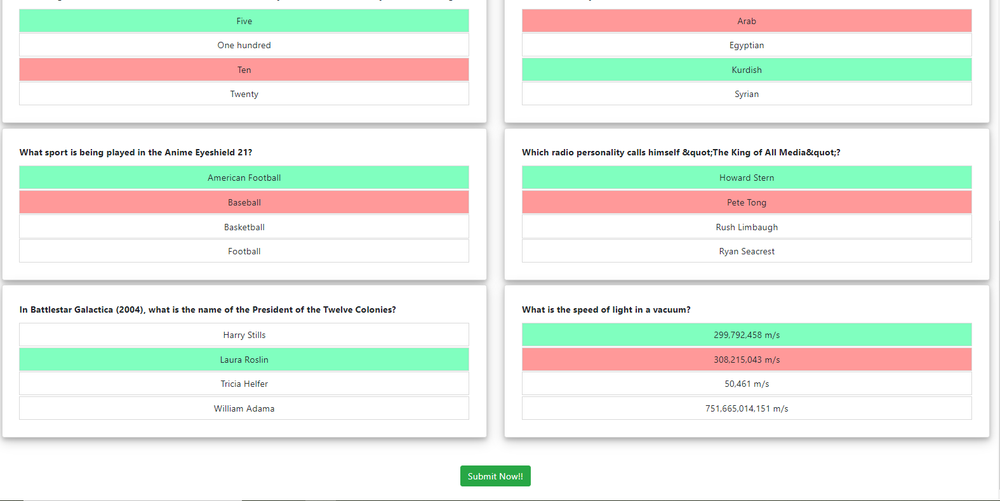
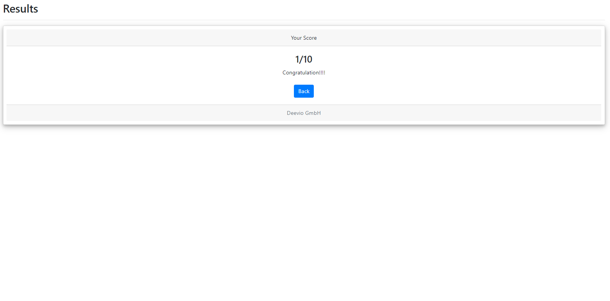
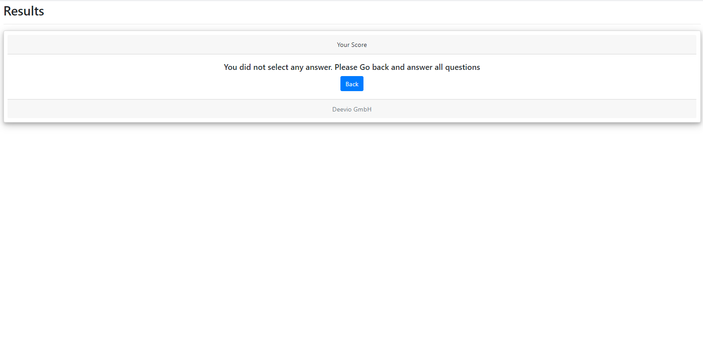

This project was bootstrapped with [Create React App](https://github.com/facebook/create-react-app).

## Available Scripts

In the project directory, First install node_modules
by:

### `yarn install`

Then you can run:

### `yarn start`

For unit test/snapshot test:

### `yarn test`

Runs the app in the development mode. 
Open [http://localhost:3000](http://localhost:3000) to view it in the browser.

Additionally I have added Loading spinner.

At the end of the question you will  see the submit button but it will not be active until you answer all of the question.
After submit, you will see the result.
Additionally, you will also find a back button to go back to the home screen.
If you reload the result page you will see a text message to answer the questions again instead of result.
Also you will find amount property win the app.js file where you could change your amount. Right now amount is 10.

N:B: Here I have spent more time than you mentioned. It is not for a particular point, it was overall (codes structure, snapshot testing, and tricky challenge).

Technologies : React, react hooks, redux , redux-saga, axios, jest and enzyme.
---
Please see the `screenshot` to see the view

